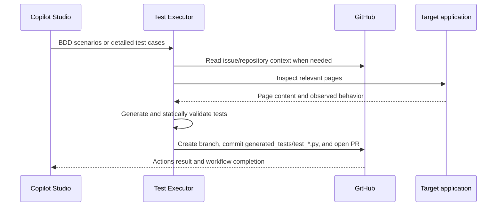

# STLC Test Executor

A reusable Microsoft Foundry hosted agent that turns BDD `.feature` scenarios or detailed test cases into Playwright Python tests, commits the generated test to GitHub, and opens a pull request for review and execution.

This repository contains the `test-executor` agent. The surrounding orchestration, requirement analysis, test-case generation, and bug logging are external integrations, typically implemented in Copilot Studio and GitHub Actions.

## Architecture



The agent manages multi-step work with a persistent todo list. It continues through planning, context gathering, test generation, validation, GitHub commit, and pull-request creation until the todo list is complete or the middleware safety limit is reached. It creates a branch from `main`, commits one generated test file, and opens a pull request. It never merges the pull request, directly triggers a pipeline, or waits for GitHub Actions to finish. The external bug logger is triggered by the completed Actions workflow.

## Capabilities

- Converts Gherkin/BDD `.feature` files and detailed test cases into Playwright Python tests.
- Preserves existing steps, expected results, test data, and acceptance criteria from detailed cases.
- Reads referenced GitHub issues and repository code when additional context is needed.
- Inspects target application pages before generating selectors and assertions.
- Uses the built-in Foundry web-search tool for focused supplemental research.
- Runs static validation before any GitHub write.
- Creates a branch, commits the generated test, and opens a pull request through GitHub MCP.
- Uses a persistent todo list to track and complete multi-step work in one agent run.
- Preserves human review by leaving pull requests open.

### Guardrails

- Target-page inspection is required whenever a target URL, page, or application flow is available.
- The agent must not invent selectors, URLs, credentials, API behavior, or test results.
- Generated tests are committed only after validation succeeds.
- Work continues until all tracked todos are complete, subject to the middleware's bounded iteration limit.
- Failed page lookups and partial GitHub operations are reported explicitly.
- Secrets and sensitive page content must not be written to generated files, commits, or pull requests.

## Generated Test Contract

The agent accepts either a Gherkin/BDD `.feature` file or a detailed test case containing steps, expected results, test data, and relevant URLs. It generates one file at `generated_tests/test_*.py` per request. The target repository must provide:

- `pytest`
- `pytest-bdd`
- `pytest-playwright`
- A GitHub Actions workflow that runs on pull requests into `main`

The expected command is:

```bash
python3 -m pytest $targets --junitxml=test-results/junit.xml
```

The built-in validator checks Python syntax, pytest discovery, selected Playwright mistakes, typo patterns, and fixed-wait warnings. It is a static smoke check; it does not execute the generated test or guarantee runtime correctness.

### Multi-step execution

The agent uses the Microsoft Agent Framework `TodoProvider` to maintain work items across the active session. `AgentLoopMiddleware` automatically starts another agent iteration while incomplete todos remain, using the provider's generated instructions and progress context. This allows the agent to recover from intermediate validation failures, gather missing context, and finish the complete workflow without requiring the orchestrator to manually replay the request. The loop has a default maximum of 10 iterations as a safety limit.

## Prerequisites and Security

- Python `>=3.14`
- `uv`
- Azure Developer CLI (`azd`)
- An Azure subscription with access to create Foundry resources
- A GitHub repository with an initialized `main` branch
- A pull-request GitHub Actions workflow in the target repository
- An RBAC-enabled Azure Key Vault
- A fine-grained GitHub PAT stored as a Key Vault secret

The hosted agent identity requires the **Key Vault Secrets User** role on the vault. The fine-grained PAT should be limited to the target repository with:

- Contents: Read and write
- Issues: Read and write
- Pull requests: Read and write
- Actions: Read
- Discussions: Read
- Metadata: Read

No Foundry toolbox is required. The agent connects directly to GitHub's remote MCP server from code.

## Configuration

Copy [.env.template](.env.template) for local configuration. Deployment values are set with `azd env set <name> <value>`.

| Variable | Required | Description |
| --- | --- | --- |
| `AZURE_SUBSCRIPTION_ID` | Yes for `azd up` | Subscription where Foundry resources are created. |
| `AZURE_LOCATION` | Yes for `azd up` | Azure region for the Foundry resource and model. |
| `AZURE_AI_PROJECT_NAME` | Yes for `azd up` | Name of the new Foundry project. |
| `FOUNDRY_PROJECT_ENDPOINT` | Yes | Foundry project endpoint. |
| `AZURE_AI_MODEL_DEPLOYMENT_NAME` | No | Model deployment; falls back to `FOUNDRY_MODEL` or `gpt-5`. |
| `AZURE_KEY_VAULT_URL` | Yes | Vault containing the GitHub PAT. |
| `GITHUB_PAT_SECRET_NAME` | No | PAT secret name; defaults to `github-test-executor-pat`. |
| `GITHUB_OWNER` | Yes | GitHub repository owner. |
| `GITHUB_REPO` | Yes | GitHub repository name. |
| `GITHUB_MCP_URL` | No | Remote MCP endpoint; defaults to `https://api.githubcopilot.com/mcp/`. |
| `GITHUB_MCP_ALLOWED_TOOLS` | No | Comma-separated client-side allow-list; defaults to `create_branch,create_or_update_file,create_pull_request,get_file_contents,search_code,issue_read,search_issues`. |

The default model deployment is the opinionated `gpt-5.6-terra` entry declared in `azure.yaml` (version `2026-07-09`, `GlobalStandard`, capacity `10`). To use a different model, edit that single `deployments` entry and set `AZURE_AI_MODEL_DEPLOYMENT_NAME` to the same deployment name. The model version and SKU must be available in the selected Azure region.

## Quickstart

The template creates the Foundry project, model deployment, and hosted agent with `azd up`:

```bash
azd auth login
azd env new stlc-test-executor-dev
azd env set AZURE_SUBSCRIPTION_ID "<subscription-id>"
azd env set AZURE_LOCATION "eastus"
azd env set AZURE_AI_PROJECT_NAME "<foundry-project-name>"
azd env set AZURE_AI_MODEL_DEPLOYMENT_NAME "gpt-5.6-terra"
azd env set AZURE_KEY_VAULT_URL "https://<your-key-vault>.vault.azure.net/"
azd env set GITHUB_PAT_SECRET_NAME "github-test-executor-pat"
azd env set GITHUB_OWNER "<github-owner>"
azd env set GITHUB_REPO "<github-repo>"
azd up
```

`azd up` runs provisioning and deployment. Provisioning creates the Foundry project and model deployment; deployment publishes the hosted agent.

After the first provision, grant the newly created test-executor Agent Identity the **Key Vault Secrets User** role on the vault, then run `azd deploy test-executor` again. Create the Key Vault, PAT secret, GitHub repository, and GitHub Actions workflow separately; this template intentionally does not create or modify GitHub resources.

## Local Development and Deployment

Install dependencies and development tooling:

```bash
uv sync --dev
uv run prek install
```

Run the hosted agent locally:

```bash
azd ai agent run
```

In another terminal, invoke the local agent:

```bash
azd ai agent invoke --local
```

Deploy the hosted agent after infrastructure already exists:

```bash
azd deploy test-executor
```

Run the local quality gates:

```bash
uv run ruff check
uv run ruff format --check
uv run ty check
uv run pytest
```

## Copilot Studio Integration

Copilot Studio can orchestrate this hosted agent alongside requirement analysis, test-case generation, and bug logging.

1. Deploy `test-executor` and note its Foundry project endpoint and Agent Id.
2. In Copilot Studio, open the orchestrator and select **Agents** → **Add an agent** → **Connect to an external agent**.
3. Choose **Microsoft Foundry**, then provide the project endpoint and `test-executor` Agent Id.
4. Route either the generated BDD `.feature` content or detailed test-case content to the external agent.

The response includes the generated branch and pull request number/URL. GitHub Actions executes the tests after the pull request opens; the external bug logger handles the completed workflow result.

## Repository Layout

```text
src/test_executor.py             Hosted agent construction and startup
src/tools.py                     GitHub MCP, web retrieval, and validation tools
src/prompts/test_executor.md     Agent behavioral contract
tests/                            Unit tests without live Azure/GitHub calls
.github/workflows/ci.yml         Repository quality checks
azure.yaml                       Foundry hosted-agent deployment definition
.env.template                    Local configuration template
```

## Validation

The repository CI workflow runs Ruff, formatting checks, `ty`, and pytest. The tests mock or isolate local logic and do not require live Azure, Key Vault, GitHub, or browser services.
